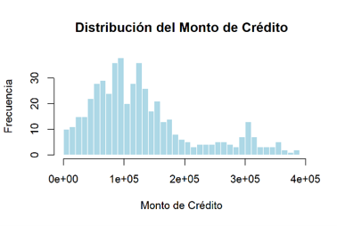
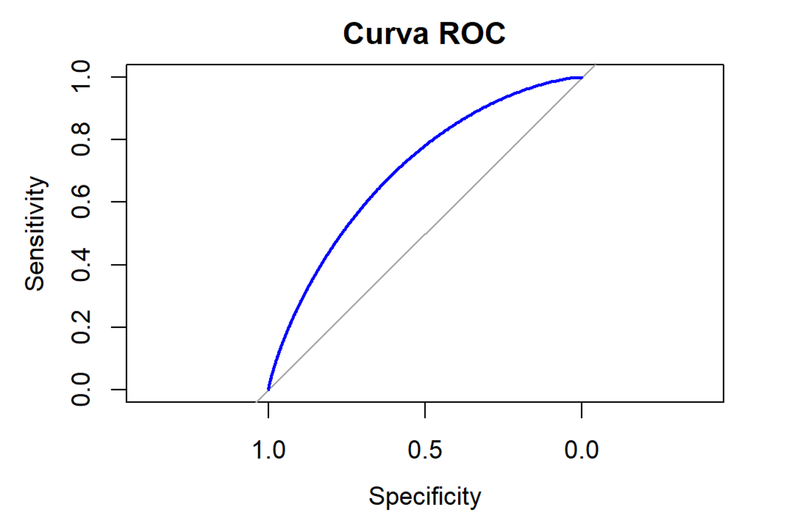
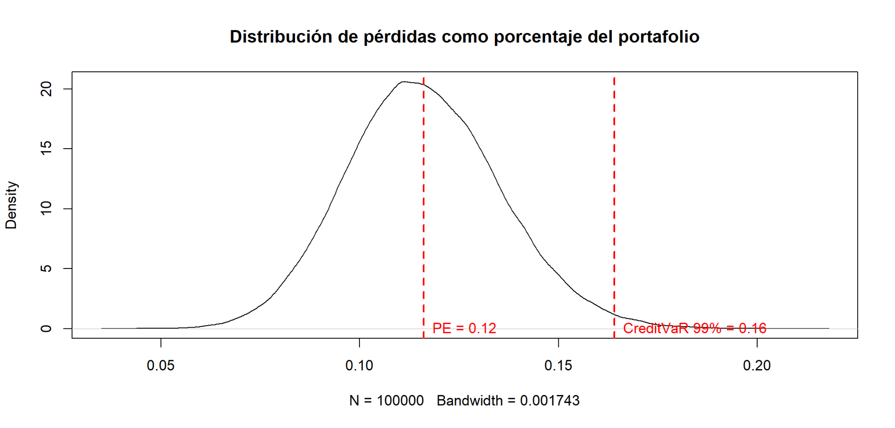

# Credit Risk Modeling: PD Estimation and Credit VaR

End-to-end credit risk analysis for a corporate loan portfolio, covering 
default probability modeling, expected loss estimation, and tail risk 
quantification via Credit VaR.

## Methodology
1. **Portfolio characterization**: HHI concentration index, default rate, 
   total exposure
2. **PD modeling**: Full Logit and Probit → stepwise variable selection 
   (AIC) → reduced model comparison
3. **Model evaluation**: ROC curve and AUC
4. **Expected loss**: EL = PD × LGD × Exposure, aggregated at portfolio 
   level
5. **Credit VaR**: Bootstrap simulation with 100,000 scenarios; defaults 
   drawn as Bernoulli variables per debtor

## Key Results

### Estimated Default Probability Distribution


### ROC Curve


### Loss Distribution


## Main Findings
- Portfolio: $64.2M total exposure; 19.8% of debtors in default; 
  HHI = 28.8 (well diversified)
- Final model: Probit with liquidity, leverage, and credit score 
  (AIC = 464.06, AUC ≈ 0.70)
- Leverage is the strongest predictor (+53.3pp marginal effect on PD); 
  liquidity and credit score act as risk mitigators
- Expected loss: $7.73M (≈12.1% of portfolio)
- Credit VaR at 99%: ≈16.4% of portfolio
- Unexpected loss / required capital: ≈4.8% → $3.08M

## Requirements
```r
install.packages(c("margins", "pROC", "ggplot2"))
```

## Usage
Place `credit_portafolio.csv` (semicolon-separated) in the working 
directory, then run `credit_risk_model.R`.

> Code comments are in Spanish, reflecting the academic context 
> in which this project was developed.
